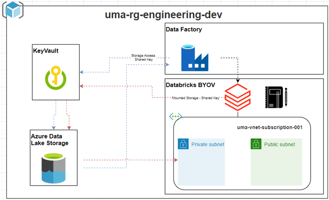

# merkle-engineering-mc-01

This repo deploys the resources necessary to implement the following architecture:

# Additional guidelines:

You can refer to the following to understand how to authenticate Terraform to Azure for various scenarios: [Microsoft documentation](https://learn.microsoft.com/en-us/azure/developer/terraform/get-started-windows-bash?tabs=bash#5-authenticate-terraform-to-azure)